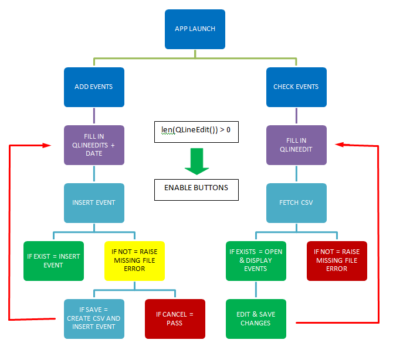
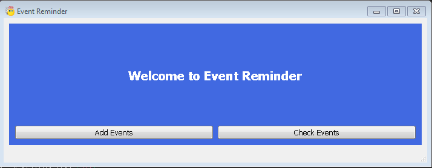
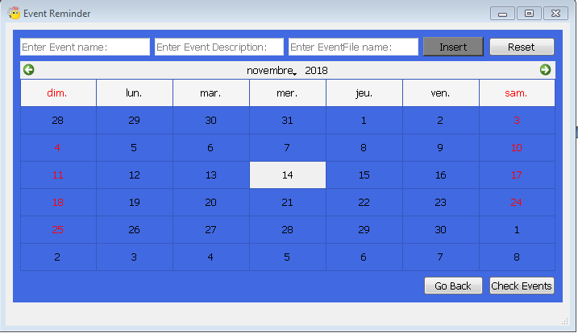
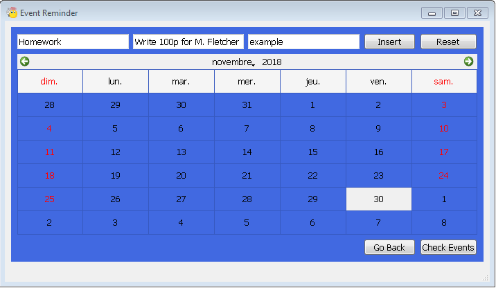
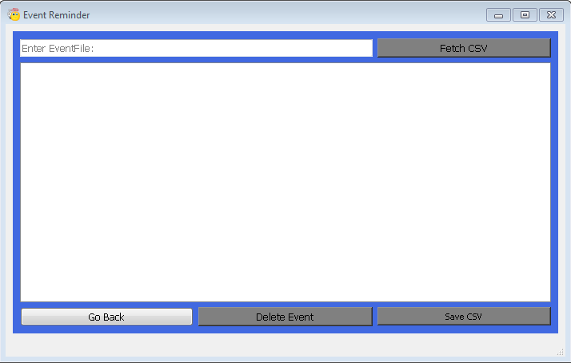
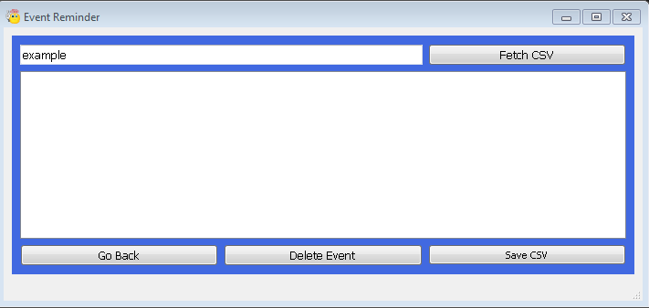
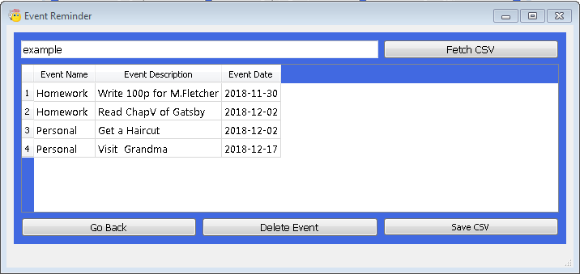
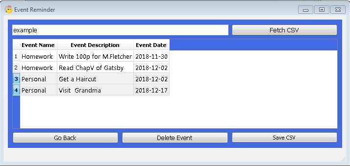
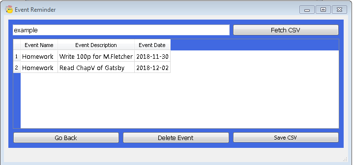
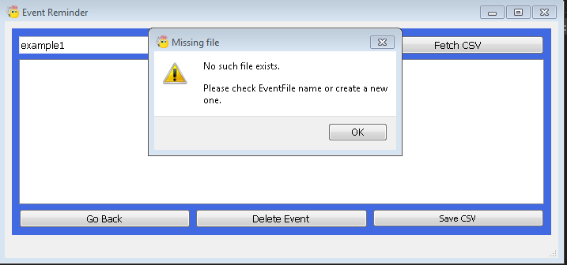

# Event_Reminder

	0.Program Conception & Logic : 

The program was built using Python, PyQt5 & Pandas, styled with CSS and compiled with PyInstaller.
The program was designed around the idea of “being dynamic” so it can display only what the user is asking for.

>Logic :

	1.Functionality:

Event Reminder is a small program that helps the user store their upcoming events (exams, homework, Interviews,) and checks them whenever they’re needed.
The targeted directory is C:\EventReminder == **EventFolder**, where the program keeps all .csv files == **EventFiles**.

While trying to add events, the program will check first if the EventFolder exists: 

	if not os.path.exists(“C:/EventReminder”):
		os.makedirs(“C:/EventReminder”)
		
if it does, the program will skip this line of code, if not, then the folder will be created.

Next the program will check if the EventFile exists:

	os.path.isfile("C:/EventReminder/example.csv")
	
if it returns **True**: the program will execute the next lines of codes to **insert** the event. 
If it returns **False**: the program will notify the user that the chosen file does not exist and ask if they want to create the EventFile.

Once all this steps are done, the program will notify the user through the statusbar of the program by showing this message:

<"C:/EventReminder/example.csv was created and populated.">

If the EventFile & the EventFolder exists, the event will then be inserted and the statusbar will display the message:

	<"Event inserted in C:/EventReminder/example.csv.">
.
	2.How to use ?
	
As mentioned in 0-*:

 
Click on either **Add Events**  or **Check Events**.

For Add Events :

 
As you can see, there are 3 empty fields and 1 disabled button. In order to enable the insert button, the length of the fields must be greater than  0.

 
Once the event is set, click on insert to send the event to example.csv

	NB0: no need to state the extension .csv  since the program adds it for you.
	NB1: The purpose of reset is to clear the fields in case you are planning on creating a new EventFile.
	NB2: careful switching between frames while creating events as it will clear() everything on leave.

For **Check Events**: 

In this frame, there are 3 disabled buttons and 1 field, the same logic applies (len > 0) as the example shows below:

Click on **Fetch CSV** to display the saved events onto the QTableWidget.

Once an event(s) happens you have the possibility to delete it by selecting the event(s) and clicking on **Delete Event**.

Once you are satisfied with the changes click on **Save CSV**. a QMessageBox will appear notifying you if you want to apply the changes **(for safety measures)**.

	NB3: If you try Fetch CSV on a non-existing file, the program will raise a missing file error.
	

**** THANK YOU ****
